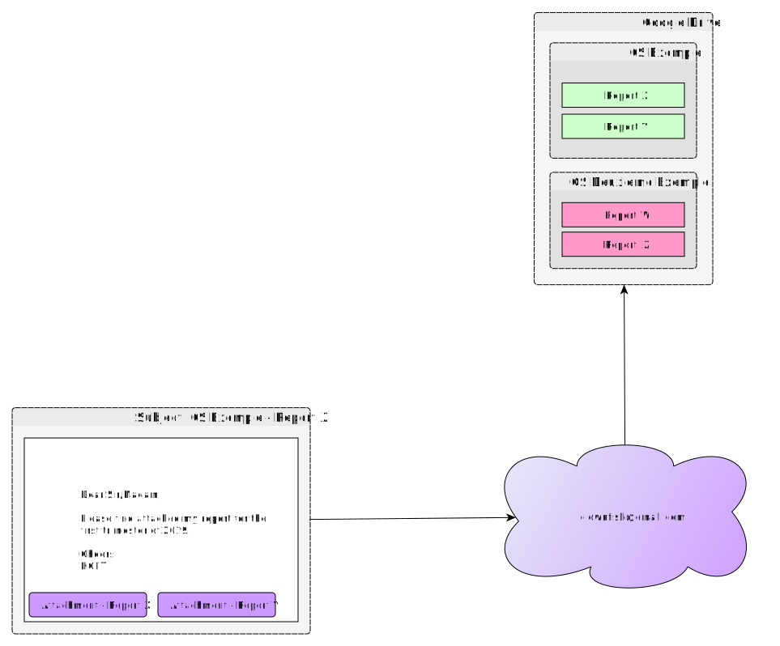

Clownfish
=========

This application is a relay between [mailgun](https://www.mailgun.com/) and [Google Drive](https://drive.google.com).  It receives messages via mailgun's `notify()` route, downloads them, and archives them in Google Drive.  It is used for aggregating reports from health structures throughout IMA World Health's area of work.

## How it works

As prerequisite, you must have a mailgun account and a domain the hosts the clownfish application.  For example: `clownfish.example.com`.
 1. Configure a Mailgun route with the action `notify()` and callback url `clownfish.example.com/receive`.
 2. Configure your google account with an OAuth account to use, and put the resulting `credentials.json` in the `credentials/` folder.
 3. Create a folder on Google Drive, and share it with relevant parties.  Determine the folder ID from the Google Drive URL and add the id as an environmental variable as `GDRIVE_REPORT_DIR_ID`.
 3. Deploy the application at `clownfish.example.com`.

Send an email to the clownfish email address with the subject line `${structure} - ${report name}`.  The application will download any attachments on that email and upload them to a Google Drive folder named `${structure}`.  If this folder does not exist, it will first create the folder and then upload the files to the folder.

## Overview

## License
[MIT](./LICENSE)
